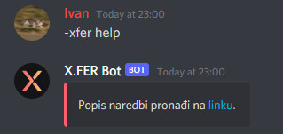
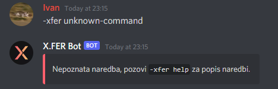

# Naredbe koje X.FER Discord bot podržava

## cf

Naredba koja za zadanog korisnika `userID` vraća podatke s Codeforces računa korisnika.

Argumenti naredbe:
- `userID` - string

Primjer korištenja:

## doprinos

Naredba koja vraća link na stranicu s uputama o doprinosu izradi X.FER Bota.

Primjer korištenja:

## ferweb

Naredba koja vraća link na stranicu predmeta na FER Webu.

Primjer korištenja:

## help

Naredba koja vraća link na popis naredbi, odnosno na ovu stranicu.

Primjer korištenja:

## materijali

Naredba koja vraća link na materijale sa stranice udruge X.FER.

Primjer korištenja:

## moj-natpro

Naredba koja vraća link na stranicu s nastavnim aktivnostima i stanjem bodova na vještini Natjecateljsko programiranje.

Primjer korištenja:

## unknown-command

Naredba koja se automatski poziva svaki put kad korisnik pozove naredbu koja ne postoji, praktički ne služi ničemu.

Primjer korištenja:

